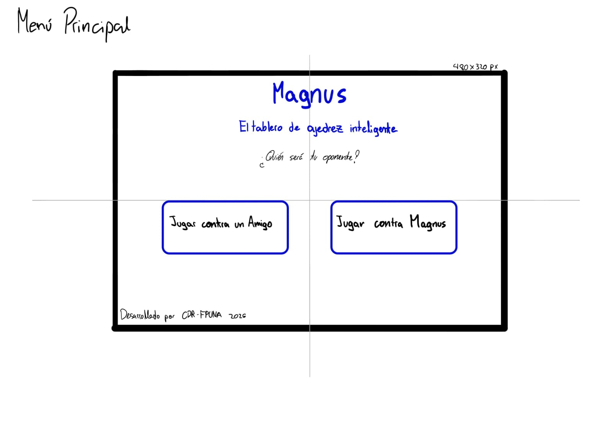
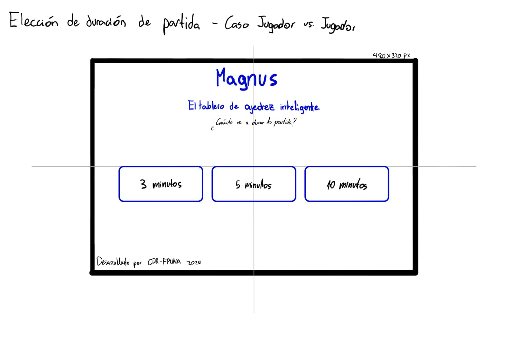
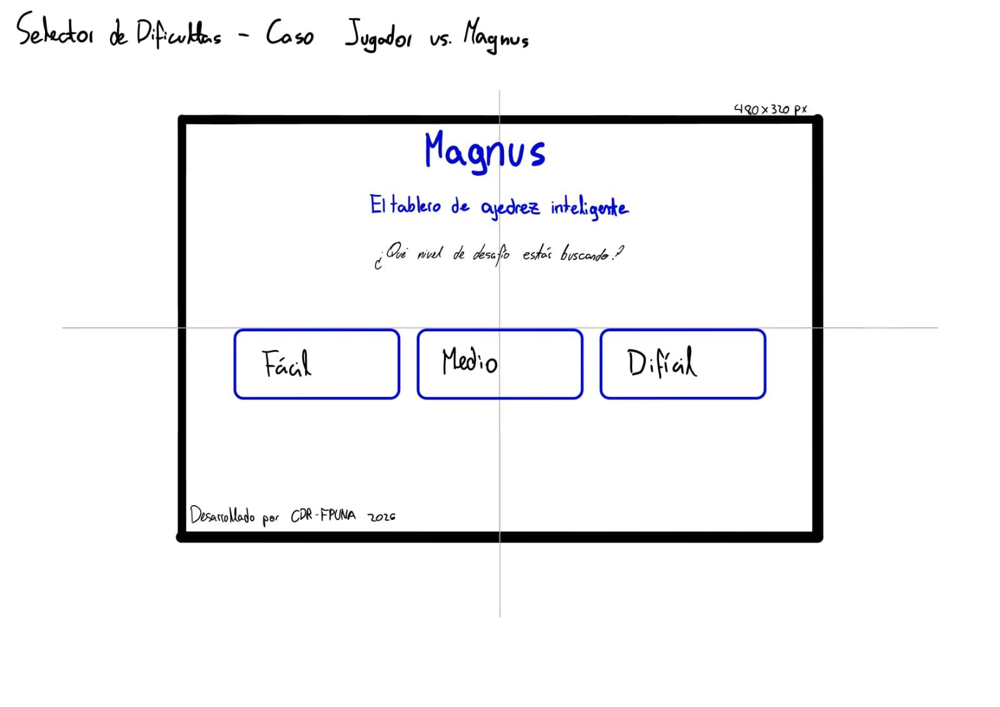
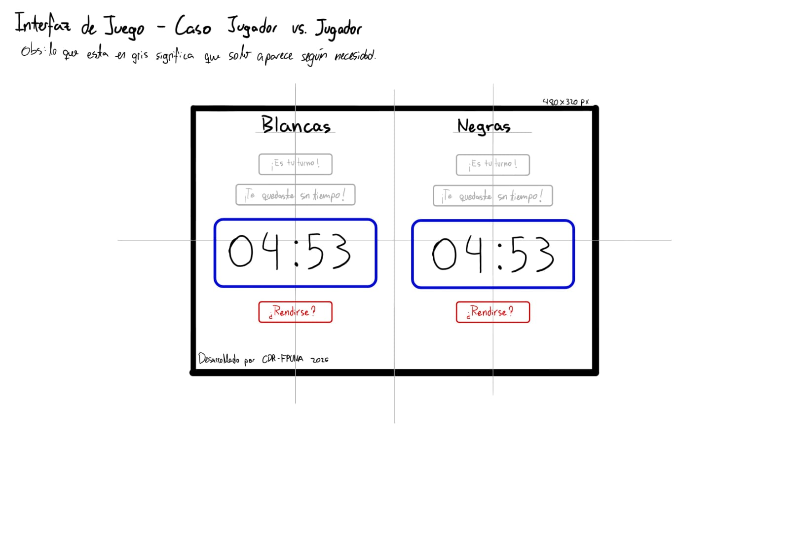
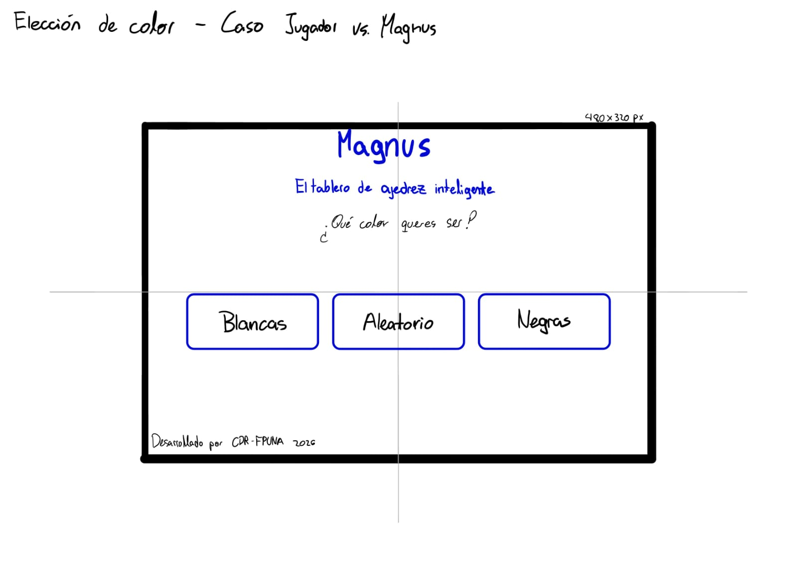
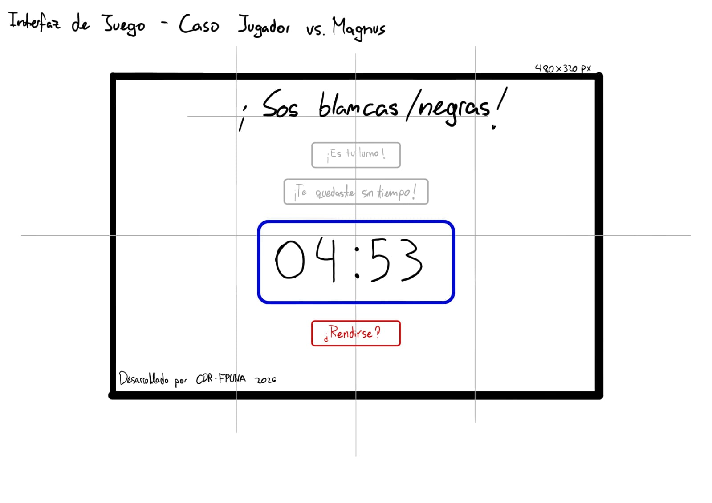

## Bocetos de la Interfaz del Tablero de Ajedrez Inteligente 'Magnus'

### Menú Principal

### Selector de Tiempo - Caso Jugador vs. Jugador

### Selector de Dificultad - Caso Jugador vs. Magnus

### Interfaz de Juego - Caso Jugador vs. Jugador

### Selector de Color - Caso Jugador vs. Magnus

### Interfaz de Juego - Caso vs. Magnus

